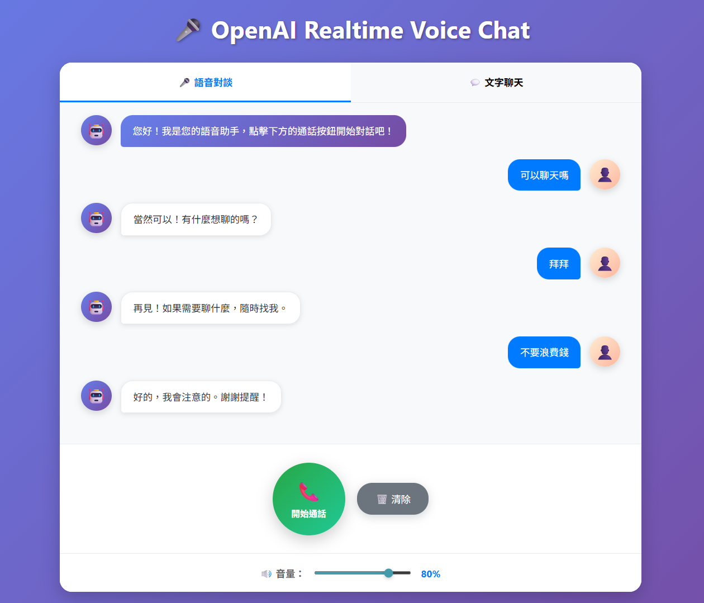
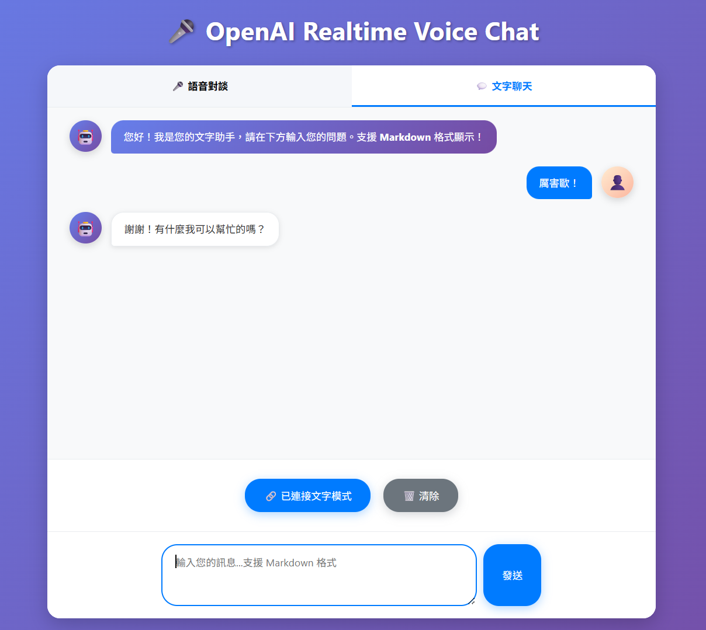

# 🎤 OpenAI Realtime Voice Chat API

一個基於 FastAPI 的即時語音對話應用程式，直接串接 OpenAI 的 Realtime API，提供低延遲的語音對語音（Speech-to-Speech）體驗。

| 語音對談模式               | 文字聊天模式              |
| -------------------------- | ------------------------- |
|  |  |

## 🌟 功能特色

✅ **雙模式分頁**: 語音對談 + 文字聊天，獨立切換使用  
✅ **即時語音對話**: 直接語音輸入，AI 即時語音回應（無疊加問題）  
✅ **Markdown 支援**: 文字模式支援完整 Markdown 格式顯示  
✅ **語音轉文字**: 專門針對繁體中文優化，更準確的語音辨識  
✅ **文字轉語音**: 使用 Alloy 語音模型，更快更自然的語音合成  
✅ **語音活動檢測**: 優化 VAD 參數，更快響應和更準確檢測  
✅ **低延遲通訊**: 基於 WebSocket 的即時雙向通訊  
✅ **音量控制**: 可調整 AI 語音回應音量  
✅ **一鍵通話**: 綠色/紅色圓形按鈕，簡化操作流程  
✅ **美化界面**: 圓形頭像、現代化氣泡對話框、漸層背景  

## 快速開始

### 1. 安裝依賴套件

```bash
pip install -r requirements.txt
```

### 2. 設定 OpenAI API Key

建立 `.env` 檔案並加入以下內容：

```env
# OpenAI API 設定
OPENAI_API_KEY=sk-xxxxxxxxxxxxxxxxxxxxxxxx

# FastAPI 設定  
DEBUG=True
HOST=0.0.0.0
PORT=8000
```

#### 🔑 如何取得 OpenAI API Key

1. 前往 OpenAI 控制台：[https://platform.openai.com/account/api-keys](https://platform.openai.com/account/api-keys)
2. 建立新的 API Key 並複製下來
3. 貼入 `.env` 檔中的 `OPENAI_API_KEY` 變數

> ⚠️ **重要**: 請確保您的 OpenAI 帳戶有足夠的額度來使用 API

### 3. 啟動服務

```bash
python main.py
```

或使用 uvicorn：

```bash
uvicorn main:app --host 0.0.0.0 --port 8000 --reload
```

### 4. 開啟瀏覽器

前往 [http://localhost:8000](http://localhost:8000) 開始使用！

## API 端點

### WebSocket 端點

- **`/realtime-voice`**: 語音對談模式的 OpenAI Realtime API 代理 WebSocket
- **`/text-chat`**: 文字聊天模式的 OpenAI Realtime API 代理 WebSocket

### HTTP 端點

- **`GET /`**: 測試界面首頁
- **`GET /health`**: 健康檢查

## 🎯 使用方式

### 🎤 語音對談模式（推薦）

1. 點擊「**🎤 語音對談**」分頁（預設已選中）
2. 點擊綠色的「**📞 開始通話**」按鈕
3. 按鈕變為紅色「**📞 通話中**」，系統自動：
   - 建立與 OpenAI Realtime API 的連接
   - 開始語音錄音和監聽
4. 直接對著麥克風說話，AI 會：
   - 自動偵測您的語音開始和結束
   - 即時轉錄您的語音內容（針對繁體中文優化）
   - 用自然的語音即時回應（無疊加問題，使用 Alloy 語音）
5. 想要結束通話時，再次點擊紅色的「**📞 通話中**」按鈕

### 💬 文字聊天模式

1. 點擊「**💬 文字聊天**」分頁切換到文字模式
2. 點擊「**🔗 連接文字模式**」按鈕建立連接
3. 在文字輸入框中輸入您的問題（支援多行輸入）
4. 點擊「**發送**」按鈕或按下 `Enter` 鍵發送
5. AI 將以 **Markdown 格式**回應，支援：
   - **粗體**、*斜體*文字
   - # 標題和子標題
   - - 列表項目
   - `程式碼` 和程式碼區塊
   - 連結和其他 Markdown 語法

### 🔧 功能控制

- **音量控制**：使用界面上的音量滑桿調整 AI 語音回應的音量（0% - 100%）
- **清除對話**：點擊「🗑️ 清除」按鈕清空當前模式的對話記錄
- **模式切換**：兩種模式有獨立的對話歷史記錄和連接狀態

> **💡 提示**：
> - 語音模式中也可以發送文字訊息進行混合對話
> - 文字模式中按 `Shift + Enter` 可換行，單獨按 `Enter` 發送訊息
> - 右下角狀態欄會顯示連接狀態和當前操作狀態

## 🏗️ 技術架構

- **後端框架**: FastAPI
- **即時通訊**: WebSocket (客戶端 ↔ 後端 ↔ OpenAI Realtime API)
- **AI 服務**: OpenAI Realtime API (gpt-4o-realtime-preview)
- **語音處理**: 
  - 語音轉文字：內建 Whisper 模型
  - 文字轉語音：內建 TTS 引擎 (alloy 語音)
  - 音頻格式：PCM16 (24kHz, 16-bit, 單音道)
- **語音檢測**: 服務器端語音活動檢測 (Server VAD)
- **前端**: 原生 HTML/JavaScript + Web Audio API

## 專案結構

```
OpenAI-Realtime/
│
├── main.py                 # FastAPI 主程式
├── static/                 # 前端靜態檔案
│   ├── index.html         # 主頁面
│   ├── style.css          # 樣式檔案
│   └── script.js          # JavaScript 邏輯
├── .env                   # 環境變數（需手動建立）
├── requirements.txt       # 相依套件
├── start.bat             # Windows 快速啟動腳本
├── .gitignore            # Git 忽略檔案
└── README.md             # 使用說明
```

## 🔧 開發說明

### OpenAI Realtime API 事件

本應用作為 WebSocket 代理，直接轉發 OpenAI Realtime API 事件：

#### 主要客戶端事件 (發送到服務器)

- **`input_audio_buffer.append`**: 發送音頻數據
- **`conversation.item.create`**: 建立對話項目 (文字訊息)
- **`response.create`**: 請求 AI 回應
- **`response.cancel`**: 取消當前回應

#### 主要服務器事件 (從服務器接收)

- **`session.created`**: 會話建立成功
- **`conversation.item.input_audio_transcription.completed`**: 語音轉文字完成
- **`response.audio_transcript.delta`**: AI 回應文字串流
- **`response.audio.delta`**: AI 回應音頻串流
- **`input_audio_buffer.speech_started/stopped`**: 語音活動檢測

### 音頻處理

- **輸入格式**: PCM16, 24kHz, 單音道
- **輸出格式**: PCM16, 24kHz, 單音道
- **編碼**: Base64 編碼的音頻數據
- **緩衝**: 4096 樣本塊處理

## ⚠️ 注意事項

- **瀏覽器要求**: 支援 Web Audio API 和 WebRTC
- **麥克風權限**: 首次使用需授權麥克風存取權限
- **網路環境**: 建議在穩定的網路環境下使用
- **HTTPS**: 生產環境建議使用 HTTPS 協議
- **API 成本**: OpenAI Realtime API 按分鐘計費
  - 音頻輸入：約 $0.06/分鐘
  - 音頻輸出：約 $0.24/分鐘
- **延遲**: 正常情況下端對端延遲 < 1 秒

## 🔍 疑難排解

### 無法連接 OpenAI Realtime API
- 檢查 API Key 是否正確設定且有效
- 確認 OpenAI 帳戶有 Realtime API 使用權限
- 檢查帳戶額度是否充足
- 確認網路連線穩定

### 語音功能無法使用
- 確認瀏覽器已授予麥克風權限
- 檢查瀏覽器是否支援 Web Audio API
- 嘗試重新整理頁面或重啟瀏覽器
- 在 HTTPS 環境下測試

### 音頻播放問題
- 檢查音量滑桿設定
- 確認系統音量未靜音
- 嘗試使用不同瀏覽器測試
- 檢查音頻輸出設備

### WebSocket 連線問題
- 確認後端服務正常運行 (http://localhost:8000/health)
- 檢查防火牆或代理設定
- 驗證埠號 8000 未被其他應用佔用
- 查看瀏覽器開發者工具的網路標籤

### 效能最佳化
- 關閉不必要的瀏覽器標籤
- 確保穩定的網路連線
- 在安靜的環境中使用以提升語音識別準確度

## 🎉 總結

此專案展示了如何使用 OpenAI 的 Realtime API 建立一個功能完整的即時語音對話系統。透過 WebSocket 代理架構，實現了：

- 🎤 **自然的語音對話體驗**
- 🔄 **即時雙向音頻串流**  
- 📝 **同步文字轉錄顯示**
- 🎛️ **彈性的音頻控制**

這個解決方案適合用於：
- 語音助手應用開發
- 客服系統整合
- 教育訓練平台
- 無障礙輔助工具

## 授權

MIT License 